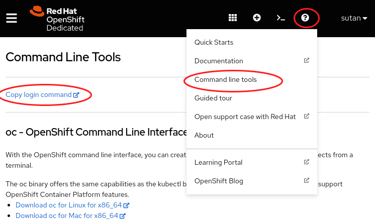
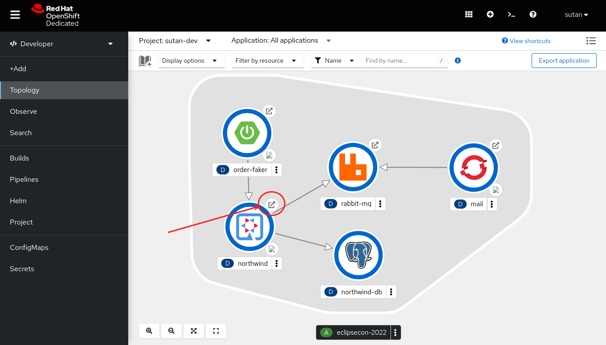
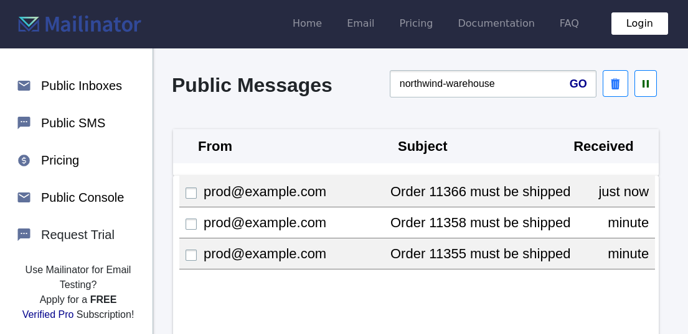
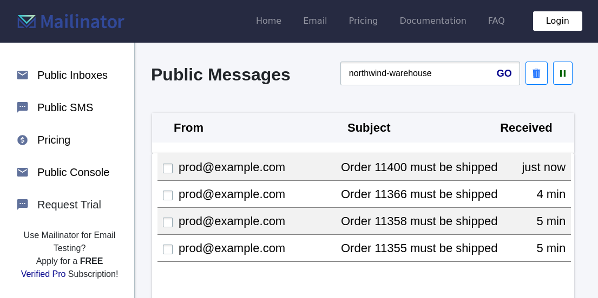
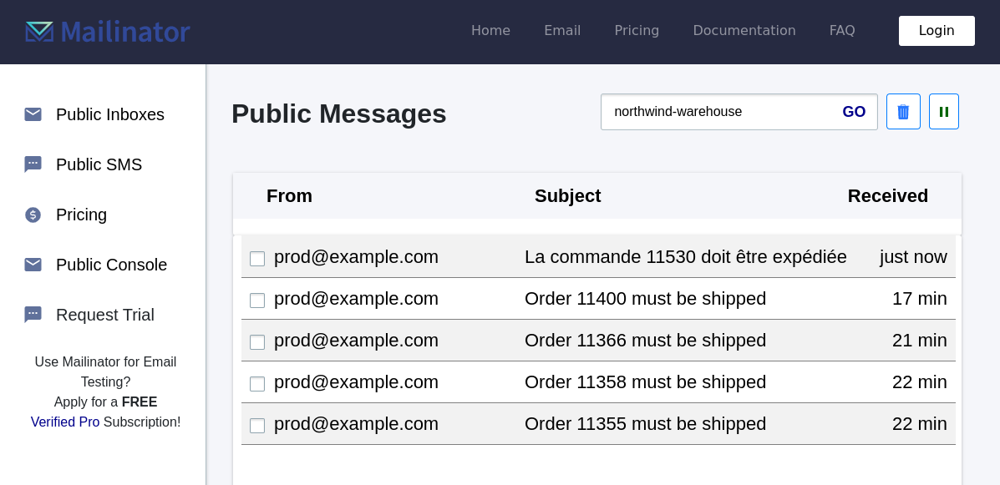
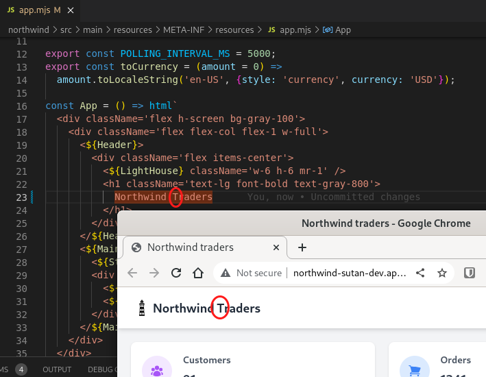

EclipseCon 2022
===============


## Deploy the application

Please jump to the [walk-through](#remote-dev-walk-through) section for a step-by-step guid on how to test-drive the
application. In case you're only interested in deploying the application, please follow the instructions below.

To easily deploy the required services, this project provides a JBang script that will deploy the application to OpenShift.

If you're running from an SH compatible terminal, you can run the following command:
```shell
./deploy-to-openshift.sh
```

From any other platform, you can run the following commands:

```shell
cd prod
jbang PrepareEnvironment.java
cd ..
mvn clean package oc:build oc:resource oc:apply
```

## Services

### Northwind traders

Module: [northwind](./northwind)

Web application for the renowned Northwind traders database.


### Mail

Module: [mail](./mail)

Sends email notifications to Mailinator.

This application is a port of a previous iteration used for Barcelona JUG presentation in 2020.

https://www.mailinator.com/v4/public/inboxes.jsp?to=jkube

### Order Faker

Module: [order-faker](./order-faker)

Fake orders and send them to the Northwind application. A new order will be sent every ~6 seconds.

This application could represent a mobile-application sending requests to the Northwind REST API. 

## Contributing

### Northwind

#### Building the Frontend

The frontend uses ES Modules in the browser, so it doesn't need a transpilation process.
However, the npm modules/libraries it relies on need to be packaged into a single file so that they can be consumed.
You can perform this step by running the following command:
```shell
cd northwind/tools
node create-bundle.js
```
The generated files should be persisted in the VCS, or generated before the application is executed/packaged.

## <span id="remote-dev-walk-through">Remote Dev demo walk-through</span>

### Prerequisites
To complete this guide, you need:

- Roughly 10 minutes
- An IDE
- An Openshift cluster. The Red Hat developer sandbox is good enough to use. See https://developers.redhat.com/developer-sandbox
- [Jbang](https://www.jbang.dev/) to deploy the RabbitMQ and PostgreSQL services
- JDK 17+
- Apache Maven 3.6.3 or higher

### Connect to the cluster
Once the Openshift cluster is up and running, you can connect your local machine to the remote cluster using the command provided in the Openshift Developer Console: Click on the question mark icon, `Command line tools`, `Copy login command`. 



In my case, the proposed command to login was something similar to:

    $ oc login --token=xxxxxxxxxxx --server=https://api.sandbox.x8i5.p1.openshiftapps.com:6443

If you don't have the `oc` command, you can download it from the `Command line tools` page.

The `oc login` command should update your `~/.kube/config` file that contains all the connection configurations to your various Kubernetes clusters. JKube and the `deploy-to-openshift.sh` script are relying on this file to connect to the right cluster.

### Deploy to Openshift
Deploy all the services to the cluster with the command:

```shell
./deploy-to-openshift.sh
```

### Try the application
In the Openshift developer console `Topology` view, you should see all the services deployed.
You can access to the Frontend through the `Northwind` service:



In the frontend, we can see the orders being injected on the fly by the `order-faker` service.

Click on the "send mail" button of one of the orders.


The Northwind application is now preparing the mail to be sent, send the event with the mail content to the RabbitMQ broker.
The Mail service should then receive the event and send the mail to the mailinator.

Check that you have receive a new email in https://www.mailinator.com/v4/public/inboxes.jsp?to=northwind-warehouse



### Remote dev
Let's say we want to modify the subject of the mail. This is done in [MailService.java](./northwind/src/main/java/com/marcnuri/demo/eclipsecon2022/northwind/MailService.java) in the Northwind service.

It is hard to test your modifications locally if you don't have all the services available. Developers could test in the dev remote cluster but this way of doing involves rebuilding the container and redeploying it. This is not very handy.

JKube provides a new feature that redirects all the traffic, intended to your service, to your local application. This feature also redirects the traffic from your local application to the remote services in the cloud.

#### Setup
Go to the Northwind project and start Quarkus devmode

```shell
$ cd northwind;
$ mvn quarkus:dev
```

In another terminal, also in the Northwind project, run the `remote-dev` goal:

```shell
$ cd northwind;
$ mvn oc:remote-dev
```

You should see message like
```
[INFO] k8s: Kubernetes Service northwind-db:5432 is now available at local port 5432
[INFO] k8s: Kubernetes Service rabbit-mq:5672 is now available at local port 15672
[INFO] k8s: Local port '8080' is now available as a Kubernetes Service at northwind:8080
```

Access/refresh the frontend. It should work now as you have not done anything. You can try to send an email and check that it has been received in mailinator. It works as before.



#### Live modification

Open the file [MailService.java](./northwind/src/main/java/com/marcnuri/demo/eclipsecon2022/northwind/MailService.java) and the `sendOrder` method, let's replace the line

```java
  final String subject = "Order " + orderId + " must be shipped";
```

with the translation in French
```java
  final String subject = "La commande " + orderId + " doit être expédiée";
```

Just go back the the Northwind frontend and send an email. Back to mailinator, the subject of the last email should be updated with the translation.



You can even change the frontend in [app.njs](./northwind/src/main/resources/META-INF/resources/app.mjs) with an uppercase `T` in `Traders`.




Stop the `remote-dev` by typing `Ctrl-c` in the terminal where it has been started

```
[INFO] getOrCreateProvider(BC) created instance of org.bouncycastle.jce.provider.BouncyCastleProvider
[INFO] Server announced support for publickey-hostbound@openssh.com version 0
[INFO] k8s: Kubernetes Service northwind-db:5432 is now available at local port 5432
[INFO] k8s: Kubernetes Service rabbit-mq:5672 is now available at local port 15672
[INFO] k8s: Local port '8080' is now available as a Kubernetes Service at northwind:8080
^C[INFO] k8s: Stopping remote development service...
Removing JKube remote development Pod [jkube-remote-dev-0b3aaa3a-c9dd-4e25-9d86-cfeb15ac0d5b]...
Remote development service stopped
```

Everything should be back to normal now and serving the original Northwind service.

#### Behind the scene
JKube `remote-dev` is creating a proxy service and redirects all the traffic to your local computer through SSH tunnels.
The Northwind service is still there, but not served anymore as long as the `remote-dev` is running.
For the access to the remote services from your local application, it is also done through SSH tunnels and the same proxy, based on configuration made in the [pom.xml](./northwind/pom.xml) file:

```xml
      <plugin>
        <groupId>org.eclipse.jkube</groupId>
        <artifactId>openshift-maven-plugin</artifactId>
        <version>${jkube.version}</version>
        <configuration>
          <remoteDevelopment>
            <localServices>
              <localService>
                <serviceName>northwind</serviceName>
                <port>8080</port>
              </localService>
            </localServices>
            <remoteServices>
              <remoteService>
                <hostname>northwind-db</hostname>
                <port>5432</port>
              </remoteService>
              <remoteService>
                <hostname>rabbit-mq</hostname>
                <port>5672</port>
                <localPort>15672</localPort>
              </remoteService>
            </remoteServices>
          </remoteDevelopment>
        </configuration>
      </plugin>
```

To have it working, the hostname of the remote service should be replaced with the local port that have been created. In a Quarkus app, this is done in [application.properties](./northwind/src/main/resources/application.properties) to pick different URL while in devmode:

```properties
quarkus.datasource.reactive.url=postgresql://northwind-db:5432/northwind
%dev.quarkus.datasource.reactive.url=postgresql://localhost:5432/northwind

rabbitmq-host=rabbit-mq
rabbitmq-port=5672
rabbitmq-username=jkube
rabbitmq-password=pa33word
%dev.rabbitmq-host=localhost
%dev.rabbitmq-port=15672
```

